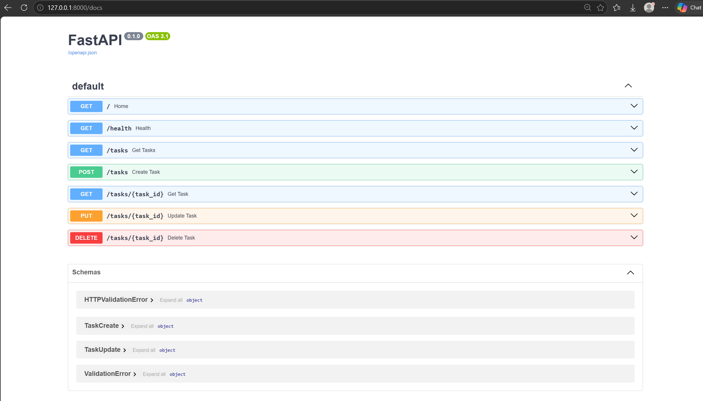
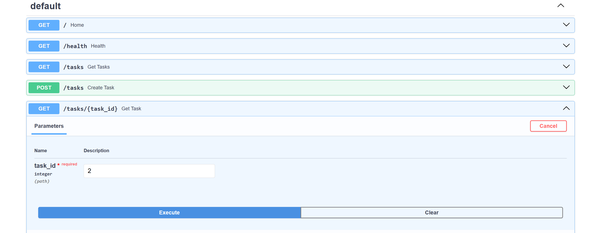
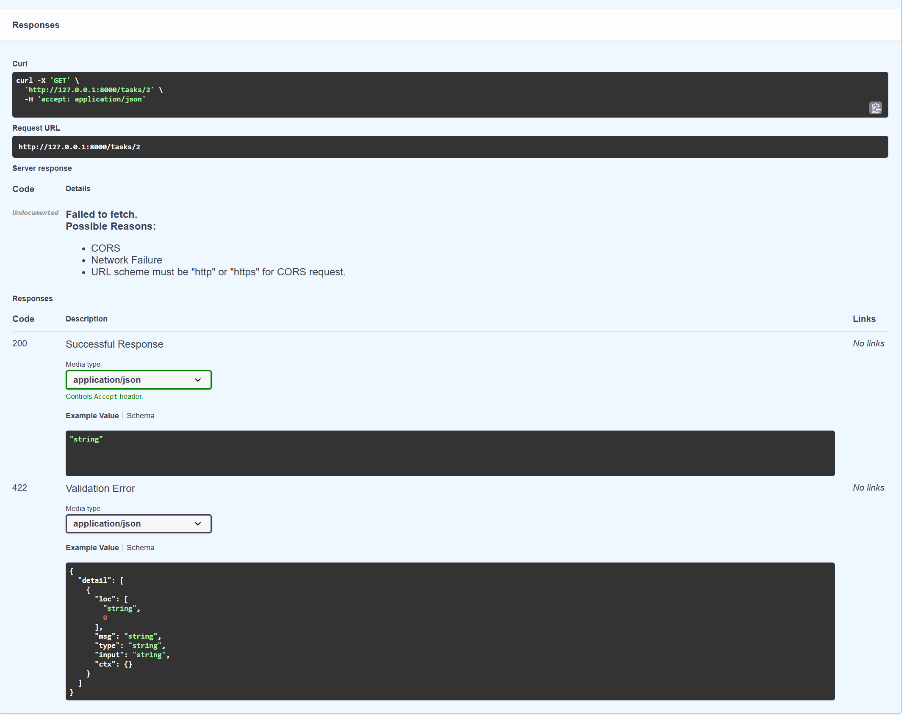

# 🚀 Task CRUD API — FastAPI + SQLite

A production-style RESTful Task Management API built with **FastAPI**, **SQLModel**, and **SQLite**.

This project demonstrates how to build a complete CRUD backend with persistent database storage, request validation, automatic API documentation, and clean separation between API, database, and data models.

---

## ✨ Features

* ✅ Create new tasks
* 📋 Retrieve all tasks
* 🔎 Retrieve a task by ID
* ✏️ Update existing tasks
* 🗑️ Delete tasks
* 💾 Persistent SQLite database storage
* 🧩 SQLModel ORM integration
* 🔐 Request validation with Pydantic
* ❤️ Health-check endpoint
* 📚 Interactive Swagger API documentation
* ⚡ FastAPI high-performance REST API
* 🔄 Automatic database/table initialization
* 🌱 Automatic sample data seeding on first startup

---

## 🛠️ Tech Stack

| Technology            | Purpose                         |
| --------------------- | ------------------------------- |
| **Python**            | Backend programming language    |
| **FastAPI**           | REST API framework              |
| **SQLModel**          | Database ORM and data modeling  |
| **SQLite**            | Lightweight relational database |
| **Uvicorn**           | ASGI application server         |
| **Pydantic**          | Request validation              |
| **Swagger / OpenAPI** | Interactive API documentation   |

---

## 📁 Project Structure

```text
task-api-sqlite-main/
│
├── main.py                 # FastAPI application and API routes
├── database.py             # SQLite database configuration
├── models.py               # SQLModel database models
├── requirements.txt        # Python dependencies
├── tasks.db                # SQLite database
├── screenshots/            # API documentation screenshots
│   ├── api_request.png
│   ├── api_response.png
│   ├── github.png
│   └── swagger.png
│
├── get-tasks.png
├── post-request.png
├── post-response.png
├── swagger.png
├── .gitignore
└── README.md
```

---

## ⚙️ Getting Started

### 1. Clone the repository

```bash
git clone https://github.com/Krishna-M18/CRUD_to_DB_SQLite.git
cd CRUD_to_DB_SQLite
```

### 2. Create a virtual environment

#### Windows

```bash
python -m venv venv
venv\Scripts\activate
```

#### macOS / Linux

```bash
python3 -m venv venv
source venv/bin/activate
```

### 3. Install dependencies

```bash
pip install -r requirements.txt
```

### 4. Start the API

```bash
uvicorn main:app --reload
```

The API will be available at:

```text
http://127.0.0.1:8000
```

---

## 📚 API Documentation

FastAPI automatically generates interactive API documentation.

### Swagger UI

Open:

```text
http://127.0.0.1:8000/docs
```

### ReDoc

Open:

```text
http://127.0.0.1:8000/redoc
```

---

## 🔌 API Endpoints

| Method   | Endpoint           | Description       |
| -------- | ------------------ | ----------------- |
| `GET`    | `/`                | API information   |
| `GET`    | `/health`          | Health check      |
| `GET`    | `/tasks`           | Get all tasks     |
| `GET`    | `/tasks/{task_id}` | Get a task by ID  |
| `POST`   | `/tasks`           | Create a new task |
| `PUT`    | `/tasks/{task_id}` | Update a task     |
| `DELETE` | `/tasks/{task_id}` | Delete a task     |

---

## 📝 Example Requests

### Create a Task

**POST `/tasks`**

```json
{
  "title": "Learn FastAPI"
}
```

Example response:

```json
{
  "id": 4,
  "title": "Learn FastAPI",
  "done": false
}
```

---

### Update a Task

**PUT `/tasks/4`**

```json
{
  "title": "Master FastAPI",
  "done": true
}
```

---

### Get All Tasks

**GET `/tasks`**

Example response:

```json
[
  {
    "id": 1,
    "title": "Study Python",
    "done": false
  },
  {
    "id": 2,
    "title": "Complete Assignment",
    "done": false
  },
  {
    "id": 3,
    "title": "Go for Walk",
    "done": true
  }
]
```

---

### Delete a Task

**DELETE `/tasks/4`**

Returns:

```text
204 No Content
```

---

## 🗄️ Database Architecture

The application uses **SQLite** for persistent data storage.

```text
Client
  │
  ▼
FastAPI
  │
  ▼
API Routes
  │
  ▼
SQLModel
  │
  ▼
SQLite
  │
  ▼
tasks.db
```

The database and tables are automatically created when the application starts.

If the database is empty, the application also inserts a small set of sample tasks for demonstration purposes.

---

## 🧱 Data Model

Each task contains:

```text
Task
├── id      → Integer primary key
├── title   → Task description
└── done    → Completion status
```

Example:

```json
{
  "id": 1,
  "title": "Study Python",
  "done": false
}
```

---

## 🧪 Testing

The API can be tested directly through Swagger UI:

```text
http://127.0.0.1:8000/docs
```

You can also test the endpoints using tools such as:

* Postman
* cURL
* Thunder Client
* Swagger UI

---

## 📸 Screenshots

### Swagger API Documentation



### API Request



### API Response



---

## 🎯 Learning Objectives

This project demonstrates practical backend engineering concepts including:

* REST API design
* CRUD operations
* FastAPI routing
* Pydantic validation
* SQLModel ORM
* SQLite database integration
* Database persistence
* HTTP status codes
* Error handling
* API documentation
* Python virtual environments
* Git and GitHub workflow

---

## 🚀 Future Improvements

Possible extensions for this project include:

* 🔐 JWT authentication
* 👤 User accounts
* 🔍 Task search and filtering
* 📄 Pagination
* 🏷️ Task categories and priorities
* 📅 Due dates
* 🧪 Automated tests with Pytest
* 🐳 Docker support
* ☁️ PostgreSQL deployment
* 🔄 CI/CD with GitHub Actions

---

## 👨‍💻 Author

**Kishore R**

Backend Engineering Project — FastAPI + SQLite

---

